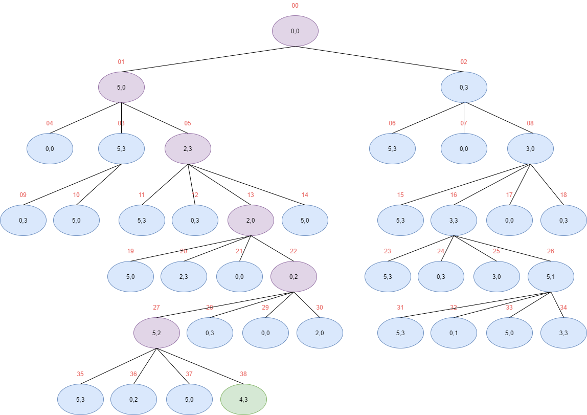
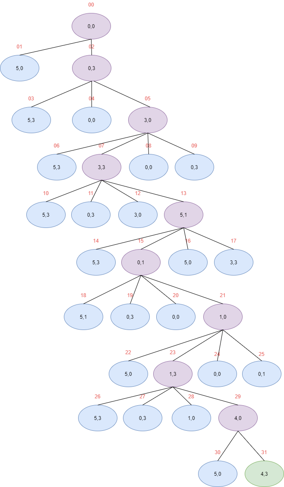

# Inteligencia Artificial. Problema jarras de agua resuelto en Python modificado por Dani 4

Hay un problema bastante conocido que puede resolverse mediante técnicas de IA, este es el problema de las jarras de agua. Es tan famoso que hasta en la película La Jungla de cristal tienen que resolverlo para impedir que una bomba explote.

## El problemaooooo

Se tienen dos jarras, una con capacidad de 5 litros y otra con 3. Ninguna de ellas tiene marcas de medición. Tenemos un grifo que permite llenar las jarras de agua.


La solución consiste en conseguir que en la jarra de 5 litros hayan exactamente 4 litros de agua, y en la de 3 litros hayan 3.

## Acciones posibles

Estas serían las acciones que podríamos ejecutar sobre las jarras de agua:

- Llenar la grande
- Llenar la pequeña
- Vaciar la grande
- Vaciar la pequeña
- Traspasar grande a pequeña
- Traspasar pequeña a grande

## Solución

Este problema puede resolverse de forma directa con un árbol de búsqueda no informada. En primer lugar lo resolveremos usando Python con un algoritmo de búsqueda en amplitud y después con un algoritmo de búsqueda en profundidad para ver si hay diferencias.

Se mantienen dos listas, una para los nodos por visitar y otra para los nodos visitados, de esta forma, evitamos que el algoritmo caiga en ciclos porque la solución podría no encontrarse nunca.

Para los dos algoritmos, usaremos una clase llamada **Nodo** dentro del archivo [arbol.py](arbol.py).

## Búsqueda en amplitud

La búsqueda en amplitud recorre el árbol por niveles siguiendo estos pasos:

- Primero cogemos el nodo raíz y lo almacenamos en una lista de nodos frontera (nodos por visitar).
- Cogemos un nodo de la lista de nodos frontera y miramos si es el objetivo, si lo es, hemos terminado y almacenaremos el nodo en la lista nodos visitados.
- Seguidamente se visitan todos sus hijos del nodo seleccionado aplicando las operaciones definidas. Para cada hijo comprobamos que no se haya visitado en la lista de nodos visitados, si no lo está, lo añadimos a la lista de nodos frontera.
- Volvemos a seleccionar un nodo de la lista de nodos frontera y repetimos el proceso hasta que encontremos el nodo meta.

Este algoritmo suele implementarse usando una cola FIFO (Primero en entrar, primero en salir), por eso, en el código fuente vemos que extraemos el primer elemento de la lista de nodos frontera usando **nodos_frontera.pop(0)**.

Este sería el árbol que nos da el resultado:



El código fuente de este algoritmo se encuentra en el archivo [amplitud.py](amplitud.py).

En este archivo tenemos la función **buscar_solucion_BFS** que se encarga de expandir el árbol usando las acciones permitidas y de mantener la lista de nodos frontera y de nodos visitados:

```python
def buscar_solucion_BFS(estado_inicial, solucion):
    solucionado = False
    nodos_visitados = []
    nodos_frontera = []

    nodoInicial = Nodo(estado_inicial)
    nodos_frontera.append(nodoInicial)

    while (not solucionado) and len(nodos_frontera) != 0:
        nodo = nodos_frontera.pop(0)  # Extraer nodo a visitar
        nodos_visitados.append(nodo)  # Añadir a nodos visitados

        if nodo.get_datos() == solucion:
            solucionado = True

            # Devuelvo el último nodo (meta) que tiene un padre, que a su vez tiene otro padre etc y ese sería el camino a la solución
            return nodo
        else:  # Expandir hijos
            dato_nodo = nodo.get_datos()

            # Llenar grande
            hijo = [5, dato_nodo[1]]

            hijo_1 = Nodo(hijo)

            if not hijo_1.en_lista(nodos_visitados) and not hijo_1.en_lista(nodos_frontera):
                nodos_frontera.append(hijo_1)

            # Llenar pequeña
            hijo = [dato_nodo[0], 3]

            hijo_2 = Nodo(hijo)

            if not hijo_2.en_lista(nodos_visitados) and not hijo_2.en_lista(nodos_frontera):
                nodos_frontera.append(hijo_2)

            # Vaciar grande
            hijo = [0, dato_nodo[1]]

            hijo_3 = Nodo(hijo)

            if not hijo_3.en_lista(nodos_visitados) and not hijo_3.en_lista(nodos_frontera):
                nodos_frontera.append(hijo_3)

            # Vaciar pequeña
            hijo = [dato_nodo[0], 0]

            hijo_4 = Nodo(hijo)

            if not hijo_4.en_lista(nodos_visitados) and not hijo_4.en_lista(nodos_frontera):
                nodos_frontera.append(hijo_4)

            # Traspasar grande-pequeña
            actual_grande = dato_nodo[0]
            actual_peque = dato_nodo[1]
            fin_grande = actual_grande
            fin_peque = actual_peque

            puedo_traspasar = 3 - actual_peque

            if puedo_traspasar > 0:
                if actual_grande <= puedo_traspasar:                    
                    fin_peque = actual_peque + fin_grande
                    fin_grande = 0

                    if fin_peque > 3:
                        fin_peque = 3
                else:
                    fin_peque = puedo_traspasar + actual_peque
                    fin_grande = actual_grande - puedo_traspasar

            hijo = [fin_grande, fin_peque]

            hijo_5 = Nodo(hijo)

            if not hijo_5.en_lista(nodos_visitados) and not hijo_5.en_lista(nodos_frontera):
                nodos_frontera.append(hijo_5)

            # Traspasar pequeña-grande
            actual_grande = dato_nodo[0]
            actual_peque = dato_nodo[1]
            fin_grande = actual_grande
            fin_peque = actual_peque

            puedo_traspasar = 5 - actual_grande

            if puedo_traspasar > 0:
                if actual_peque <= puedo_traspasar:                    
                    fin_grande = actual_grande + fin_peque
                    fin_peque = 0

                    if fin_grande > 5:
                        fin_grande = 5
                else:
                    fin_grande = puedo_traspasar + actual_grande
                    fin_peque = actual_peque - puedo_traspasar

            hijo = [fin_grande, fin_peque]

            hijo_6 = Nodo(hijo)

            if not hijo_6.en_lista(nodos_visitados) and not hijo_6.en_lista(nodos_frontera):
                nodos_frontera.append(hijo_6)

            nodo.set_hijos([hijo_1, hijo_2, hijo_3, hijo_4, hijo_5, hijo_6])
```

Por último, tenemos la función **main** que recoge el nodo solución que devolvió la función **buscar_solucion_BFS** y crea una lista de todos los padres de ese nodo, para al final, hacer un print con el camino resultante:

```python
if __name__ == '__main__':
    estado_inicial = [0, 0]
    solucion = [4, 3]

    nodo_solucion = buscar_solucion_BFS(estado_inicial, solucion)

    # Creo una lista de todos los padres del nodo solución
    resultado = []
    nodo = nodo_solucion

    while nodo.get_padre() != None:
        resultado.append(nodo.get_datos())
        nodo = nodo.get_padre()

    resultado.append(estado_inicial)
    resultado.reverse()

    print(resultado)
```

El print del resultado nos mostraría lo siguiente:

```
[[0, 0], [5, 0], [2, 3], [2, 0], [0, 2], [5, 2], [4, 3]]
```

Como vemos, coincide con el camino encontrado en la imagen del árbol.


## Búsqueda en profundidad

La búsqueda en profundidad es algo diferente a la búsqueda en amplitud. En lugar de ir visitando todos los nodos del mismo nivel, va descendiendo por una rama hasta la profundidad máxima, cuando llega al nodo más profundo, continúa con la siguiente rama.

Este algoritmo suele implementarse usando una cola LIFO (Último en entrar, primero en salir), por eso, en el código fuente vemos que extraemos el último elemento de la lista de nodos frontera usando **nodos_frontera.pop()**.

Este sería el árbol que nos da el resultado:



El código fuente de este algoritmo se encuentra en el archivo [profundidad.py](profundidad.py).

En este archivo tenemos la función **buscar_solucion_DFS** que se encarga de expandir el árbol usando las acciones permitidas y de mantener la lista de nodos frontera y de nodos visitados. La diferencia con la función **buscar_solucion_BFS** del otro algoritmo es la forma en la que extraemos los nodos de la lista de nodos frontera:

```python
def buscar_solucion_DFS(estado_inicial, solucion):
    solucionado = False
    nodos_visitados = []
    nodos_frontera = []

    nodoInicial = Nodo(estado_inicial)
    nodos_frontera.append(nodoInicial)

    while (not solucionado) and len(nodos_frontera) != 0:
        nodo = nodos_frontera.pop()  # Extraer nodo a visitar
        nodos_visitados.append(nodo)  # Añadir a nodos visitados

        if nodo.get_datos() == solucion:
            solucionado = True

            # Devuelvo el último nodo (meta) que tiene un padre, que a su vez tiene otro padre etc y ese sería el camino a la solución
            return nodo
        else:  # Expandir hijos
            dato_nodo = nodo.get_datos()

            # Llenar grande
            hijo = [5, dato_nodo[1]]

            hijo_1 = Nodo(hijo)

            if not hijo_1.en_lista(nodos_visitados) and not hijo_1.en_lista(nodos_frontera):
                nodos_frontera.append(hijo_1)

            # Llenar pequeña
            hijo = [dato_nodo[0], 3]

            hijo_2 = Nodo(hijo)

            if not hijo_2.en_lista(nodos_visitados) and not hijo_2.en_lista(nodos_frontera):
                nodos_frontera.append(hijo_2)

            # Vaciar grande
            hijo = [0, dato_nodo[1]]

            hijo_3 = Nodo(hijo)

            if not hijo_3.en_lista(nodos_visitados) and not hijo_3.en_lista(nodos_frontera):
                nodos_frontera.append(hijo_3)

            # Vaciar pequeña
            hijo = [dato_nodo[0], 0]

            hijo_4 = Nodo(hijo)

            if not hijo_4.en_lista(nodos_visitados) and not hijo_4.en_lista(nodos_frontera):
                nodos_frontera.append(hijo_4)

            # Traspasar grande-pequeña
            actual_grande = dato_nodo[0]
            actual_peque = dato_nodo[1]
            fin_grande = actual_grande
            fin_peque = actual_peque

            puedo_traspasar = 3 - actual_peque

            if puedo_traspasar > 0:
                if actual_grande <= puedo_traspasar:                    
                    fin_peque = actual_peque + fin_grande
                    fin_grande = 0

                    if fin_peque > 3:
                        fin_peque = 3
                else:
                    fin_peque = puedo_traspasar + actual_peque
                    fin_grande = actual_grande - puedo_traspasar

            hijo = [fin_grande, fin_peque]

            hijo_5 = Nodo(hijo)

            if not hijo_5.en_lista(nodos_visitados) and not hijo_5.en_lista(nodos_frontera):
                nodos_frontera.append(hijo_5)

            # Traspasar pequeña-grande
            actual_grande = dato_nodo[0]
            actual_peque = dato_nodo[1]
            fin_grande = actual_grande
            fin_peque = actual_peque

            puedo_traspasar = 5 - actual_grande

            if puedo_traspasar > 0:
                if actual_peque <= puedo_traspasar:                    
                    fin_grande = actual_grande + fin_peque
                    fin_peque = 0

                    if fin_grande > 5:
                        fin_grande = 5
                else:
                    fin_grande = puedo_traspasar + actual_grande
                    fin_peque = actual_peque - puedo_traspasar

            hijo = [fin_grande, fin_peque]

            hijo_6 = Nodo(hijo)

            if not hijo_6.en_lista(nodos_visitados) and not hijo_6.en_lista(nodos_frontera):
                nodos_frontera.append(hijo_6)

            nodo.set_hijos([hijo_1, hijo_2, hijo_3, hijo_4, hijo_5, hijo_6])
```

Por último, tenemos la función **main** que recoge el nodo solución que devolvió la función **buscar_solucion_DFS** y crea una lista de todos los padres de ese nodo, para al final, hacer un print con el camino resultante:

```python
if __name__ == '__main__':
    estado_inicial = [0, 0]
    solucion = [4, 3]

    nodo_solucion = buscar_solucion_DFS(estado_inicial, solucion)

    # Creo una lista de todos los padres del nodo solución
    resultado = []
    nodo = nodo_solucion

    while nodo.get_padre() != None:
        resultado.append(nodo.get_datos())
        nodo = nodo.get_padre()

    resultado.append(estado_inicial)
    resultado.reverse()

    print(resultado)
```

El print del resultado nos mostraría lo siguiente:

```
[[0, 0], [0, 3], [3, 0], [3, 3], [5, 1], [0, 1], [1, 0], [1, 3], [4, 0], [4, 3]]
```

Como vemos, coincide con el camino encontrado en la imagen del árbol, además, el resultado es visiblemente peor que el obtenido con la búsqueda en amplitud, lo que indica que la solución encontrada no es óptima.

## Agradecimientos 🎁

- Comenta a otros este proyecto 📢
- Da las gracias públicamente 🤓
- Sígueme en [Twitter](https://twitter.com/AsensiFj) 🐦
